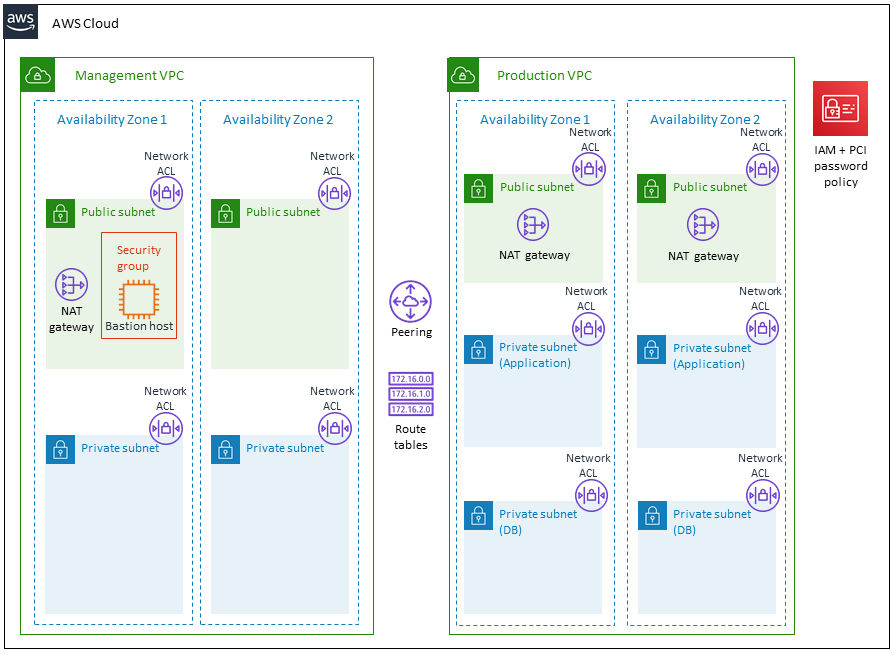

## Summary

This repo will create a PCI-DSS environment, with the following modules:
  - productionvpc
  - managementvpc
  - iam_password
  - iam
  - centralized_logging
  - database
  - application

## 2. Basic Architecture



## Built with:

* Terraform (v0.14.0)
* AWS_ACCESS_KEYS and AWS_SECRET_ACCESS_KEYS are set as environment variables (link: https://docs.aws.amazon.com/cli/latest/userguide/cli-configure-envvars.html)

### Step by Step deployment
* **Step 1: Clone the Repo**. This command will clone the repo and will change directory the recently cloned repo
```shell script
$ git clone https://github.com/antonio-rufo/tf-sandys.git
```


* **Step 2: Create a S3 bucket for remote state storage.** Update the `terraform.tfvars` file with your account ID and region
```shell script
$ cd tf-sandys
$ cd statebucket
$ vi terraform.tfvars
```
Create the resources:
```shell script
$ terraform init
$ terraform plan
$ terraform apply --auto-approve
```
Take note of the output for `state_bucket_id`. You'll need to update the `main.tf` on each layer with it. It is not yet possible to have the state bucket values interpolated.  


* **Step 3: Create your PCI DSS environment.** Update the `terraform.tfvars` file with your account ID, region, and fill up all required variables. Then update `main.tf` with the **state_bucket_id** created in step 2 (line 13) as well as the **region** (line 15).
```shell script
$ cd ../environment
$ vi terraform.tfvars
$ vi main.tf
```
Create the resources:
```shell script
$ terraform init
$ terraform plan
$ terraform apply --auto-approve
```
